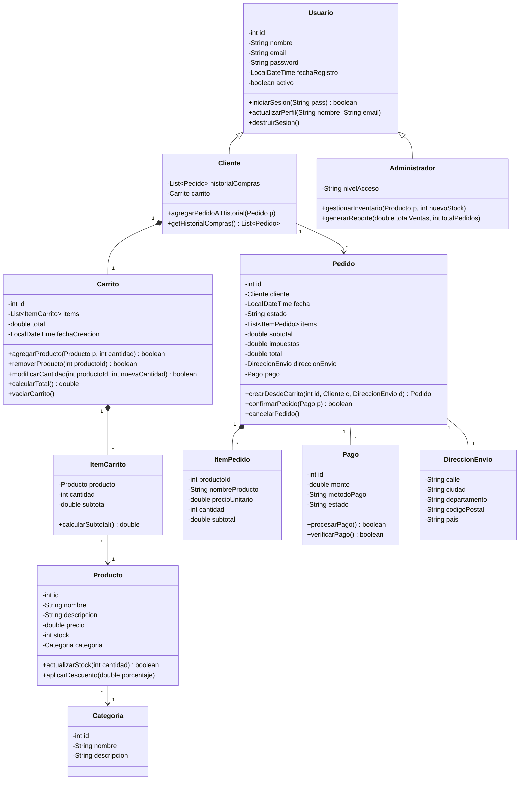

# 🛒 CompraYa - Plataforma de Comercio Electrónico (Java OOP)

**Asignación No. 1 - Diseño Conceptual e Implementación en POO**  
**Curso:** CSE6041 – Object-Oriented Programming  
**Institución:** Broward International University (BIU)  
**Estudiante:** Alberto Alfonso López Pereira  
**Docente:** Dr. José Ignacio Requeno Jarabo  

---

## 📋 Descripción del Proyecto

**CompraYa** es una plataforma de comercio electrónico multi-categoría (electrónica, hogar y moda) diseñada para pequeñas y medianas empresas. El proyecto traslada los principios de consistencia, trazabilidad y control de estado de sistemas transaccionales de alto volumen a una arquitectura orientada a objetos en **Java**.

El sistema permite a un **Cliente** autenticarse, explorar un catálogo multi-categoría, gestionar dinámicamente su **Carrito de Compras** (añadir, modificar cantidades, remover productos y calcular subtotales e impuestos), procesar el checkout y generar un **Pedido** con pasarela de pago. Asimismo, permite a un **Administrador** gestionar el stock del catálogo y generar reportes consolidado de ventas.

---

## 🛠️ Tecnologías Utilizadas

- **Lenguaje de Programación:** Java 21 (OpenJDK / JetBrains Runtime).
- **Paradigma:** Programación Orientada a Objetos (POO).
- **Herramientas de Construcción:** `javac` (compilador nativo de Java), `java` (máquina virtual Java execution).
- **Control de Versiones:** Git & GitHub.
- **Modelado:** UML 2.0 y Diagramas en sintaxis Mermaid.

---

## 🏗️ Estructura del Proyecto

```text
eCommerceCSE6041/
├── src/
│   └── com/
│       └── compraya/
│           ├── model/
│           │   ├── Categoria.java        # Clasificación del catálogo
│           │   ├── Producto.java         # Clase Producto (Req. 1)
│           │   ├── Usuario.java          # Clase Usuario Base (Req. 2)
│           │   ├── Cliente.java          # Rol Cliente (Herencia de Usuario)
│           │   ├── Administrador.java    # Rol Administrador (Herencia de Usuario)
│           │   ├── ItemCarrito.java      # Elemento en el carrito (Composición)
│           │   ├── Carrito.java          # Clase Carrito de Compras (Req. 3)
│           │   ├── ItemPedido.java       # Snapshot inmutable de ítem comprado
│           │   ├── DireccionEnvio.java   # Información de despacho
│           │   ├── Pago.java             # Procesamiento simulado de pasarela
│           │   └── Pedido.java           # Registro transaccional de compra
│           ├── service/
│           │   └── EcommerceService.java # Orquestador y catálogo de productos
│           └── Main.java                 # Punto de entrada y suite de pruebas
├── docs/
│   ├── DOCS_ARQUITECTURA_OOP.md          # Documentación detallada de requerimientos RF/RNF
│   ├── GUIA_EJECUCION.md                 # Instrucciones paso a paso para compilación y GitHub
│   └── EJECUCION_OUTPUT.txt              # Registro en texto plano de la consola
└── README.md                             # Documentación principal del repositorio
```

---

## 💻 Implementación de Clases POO

### 1. Clase `Producto` (`src/com/compraya/model/Producto.java`)
- **Atributos:** `id` (int), `nombre` (String), `descripcion` (String), `precio` (double), `stock` (int), `categoria` (Categoria).
- **Constructor:** `Producto(int id, String nombre, String descripcion, double precio, int stock, Categoria categoria)` inicializa el objeto garantizando validaciones de precio y stock no negativos.
- **Métodos Getter/Setter:** Propiedades completas para lectura y modificación segura de atributos encapsulados.
- **Métodos de Negocio:**
  - `actualizarStock(int cantidad)`: Incrementa o decrementa la cantidad en inventario validando disponibilidad.
  - `aplicarDescuento(double porcentaje)`: Calcula y descuenta un porcentaje sobre el precio unitario del producto.

### 2. Clase `Usuario` (`src/com/compraya/model/Usuario.java`)
- **Atributos:** `id` (int), `nombre` (String), `email` (String), `password` (String), `fechaRegistro` (LocalDateTime), `activo` (boolean).
- **Constructor:** `Usuario(int id, String nombre, String email, String password)` inicializa las credenciales y establece la fecha de registro actual.
- **Métodos de Gestión:**
  - `iniciarSesion(String pass)`: Valida la contraseña y estado de cuenta.
  - `actualizarPerfil(String nuevoNombre, String nuevoEmail)`: Modifica datos del usuario.
  - `destruirSesion()`: **Destructor / Método de Limpieza Lógica** que desactiva la cuenta y libera el estado en memoria.
- **Herencia:** Extendida por las clases especializadas `Cliente` (con historial de compras y carrito) y `Administrador` (con nivel de acceso, actualización de stock y reporte de ventas).

### 3. Clase `Carrito` (`src/com/compraya/model/Carrito.java`)
- **Atributos:** `id` (int), `items` (`List<ItemCarrito>`), `total` (double), `fechaCreacion` (LocalDateTime).
- **Constructor:** `Carrito()` inicializa la lista interna de productos seleccionados y reinicia el total a `$0.00`.
- **Métodos Requeridos:**
  - `agregarProducto(Producto producto, int cantidad)`: Inserta un producto verificando stock disponible o incrementa su cantidad si ya existía. Recalcula automáticamente el total.
  - `removerProducto(int productoId)`: Elimina un producto por su ID del carrito y actualiza el total.
  - `modificarCantidad(int productoId, int nuevaCantidad)`: Modifica la cantidad requerida respetando el límite de inventario.
  - `calcularTotal()`: Recalcula la suma de los subtotales de todos los productos en el carrito (`Σ (precio * cantidad)`).
  - `vaciarCarrito()`: Limpia la lista de productos y reinicia el saldo a `$0.00`.

---

## 📐 Diagrama de Clases UML (Mermaid)



---

## 📸 Capturas y Demostración de Ejecución

A continuación se muestra el resultado en consola al ejecutar la suite completa de demostración (`com.compraya.Main`):

```text
====================================================================
               PLATAFORMA E-COMMERCE "COMPRAYA"                     
        Demostración de Requerimientos POO (Curso CSE6041)          
====================================================================
Estudiante: Alberto Alfonso López Pereira
Docente:    Dr. José Ignacio Requeno Jarabo
Institución: Broward International University (BIU)
====================================================================

=======================================================
  1. DEMOSTRACIÓN Y PRUEBA DE LA CLASE 'PRODUCTO'
=======================================================
[CREACIÓN] Objeto Producto inicializado exitosamente:
   -> Producto[ID: 101 | Nombre: Laptop Gamer Ultra | Precio: $6500000,00 | Stock: 10 | Categ: Electrónica]

[PROPIEDADES] Invocación de Getters:
   - ID: 101
   - Nombre: Laptop Gamer Ultra
   - Descripción: Intel i9, 32GB RAM, RTX 4080
   - Precio: $6500000,00
   - Stock disponible: 10

[MÉTODOS DE NEGOCIO]
   * Aplicando 10% de descuento...
   -> Nuevo Precio tras descuento: $5850000,00
   * Actualizando stock (-2 unidades vendidas)...
   -> Nuevo Stock en inventario: 8

=======================================================
  2. DEMOSTRACIÓN Y PRUEBA DE LA CLASE 'USUARIO'
=======================================================
[CREACIÓN] Objeto Usuario inicializado:
   -> Usuario[ID: 201 | Nombre: Carlos Ramírez | Email: carlos.ramirez@mail.com | Activo: true]

[AUTENTICACIÓN] Prueba de inicio de sesión:
   - ¿Autenticación con clave correcta?: ÉXITO
   - ¿Autenticación con clave errónea?:  FALLO (Esperado)

[GESTIÓN DE PERFIL] Actualizando nombre y correo...
   -> Perfil Actualizado: Carlos A. Ramírez (carlos.actualizado@mail.com)

[HERENCIA] Creando Cliente y Administrador:
   - Cliente[ID: 1 | Nombre: Alberto López | Email: alberto.lopez@example.com | Compras: 0]
   - Administrador[ID: 2 | Nombre: José Requeno | NivelAcceso: SUPERADMIN]

[DESTRUCTOR/LIMPIEZA LOGICA] Ejecutando destruirSesion():
Destruyendo sesión activa para el usuario ID 201 (carlos.actualizado@mail.com)...
   -> Estado activo tras destrucción: false

=======================================================
  3. DEMOSTRACIÓN Y PRUEBA DE LA CLASE 'CARRITO'
=======================================================
[ESTADO INICIAL]
=== Carrito de Compras (Total: $0,00) ===
 [El carrito está vacío]

[AÑADIR PRODUCTOS]
   * Agregando 2 Audífonos Bluetooth...
   * Agregando 1 Cafetera Express...
   * Agregando 1 Zapatillas Deportivas...

[CARRITO TRAS ADICIONES]
=== Carrito de Compras (Total: $1170000,00) ===
 - Audífonos Bluetooth x2 -> Subtotal: $500000,00
 - Cafetera Express x1 -> Subtotal: $450000,00
 - Zapatillas Deportivas x1 -> Subtotal: $220000,00

[MODIFICAR CANTIDAD]
   * Modificando cantidad de Audífonos a 3...
   -> Total recalculado: $1420000,00

[REMOVER PRODUCTO]
   * Removiendo Zapatillas Deportivas (ID 6)...
   -> ¿Producto removido con éxito?: true

[CARRITO ACTUALIZADO]
=== Carrito de Compras (Total: $1200000,00) ===
 - Audífonos Bluetooth x3 -> Subtotal: $750000,00
 - Cafetera Express x1 -> Subtotal: $450000,00

=======================================================
  4. FLUJO COMPLETO: CHECKOUT, IMPUESTOS Y PAGO
=======================================================
[DIRECCIÓN DE ENVÍO] Carrera 7 #45-12, Bogotá, Cundinamarca (110111) - Colombia

[PROCESANDO CHECKOUT Y PASARELA DE PAGO]
[PAGO] Procesando pago de $1428000,00 vía Pasarela Externa (TARJETA_CREDITO)...
[PAGO] Transacción aprobada exitosamente. ID de Transacción: TXN-5001
[PEDIDO #1001] Confirmado y pagado con éxito. Total: $1428000,00

[PEDIDO GENERADO EXITOSAMENTE]
==========================================
          DETALLE DE PEDIDO #1001           
==========================================
Cliente: Alberto López (alberto.lopez@example.com)
Fecha: 2026-09-15T22:15:22.049842400
Estado: PAGADO
Dirección: Carrera 7 #45-12, Bogotá, Cundinamarca (110111) - Colombia
Ítems Adquiridos:
  • Audífonos Bluetooth (ID: 2) x3 @ $250000,00 = $750000,00
  • Cafetera Express (ID: 3) x1 @ $450000,00 = $450000,00
------------------------------------------
 Subtotal:  $1200000,00
 IVA (19%): $228000,00
 TOTAL:     $1428000,00
==========================================

[VERIFICACIÓN DE IMPACTO EN INVENTARIO Y CARRITO]
   - Stock restante de Audífonos (Inicial: 30): 27
   - Stock restante de Cafetera  (Inicial: 10): 9
   - Estado del carrito del cliente: Vacío (Correcto)

=======================================================
  5. MÓDULO DE ADMINISTRACIÓN Y REPORTES DE VENTAS
=======================================================
[ADMIN José Requeno] Stock actualizado para 'Laptop Gamer Ultra': 25 unidades.
==========================================
         REPORTE DE VENTAS COMPRAYA       
==========================================
Generado por Admin: José Requeno (SUPERADMIN)
Total de Pedidos Procesados: 1
Ingresos Totales Acumulados: $1428000,00
==========================================
```

---

## ⚡ Desafíos Enfrentados y Soluciones Aplicadas

| Desafío Enfrentado | Causa Raíz | Solución Aplicada |
| :--- | :--- | :--- |
| **Inmutabilidad del Historial de Precios** | Si el administrador cambia el precio de un `Producto` en el catálogo, los pedidos históricos antiguos cambiarían su total retrospectivamente. | Se creó la clase `ItemPedido` como una **snapshot inmutable** que copia el nombre y el precio unitario del producto en el instante exacto de la compra, desacoplándolo de variaciones futuras del catálogo. |
| **Consistencia de Inventario** | Permitir que usuarios agreguen productos al carrito sin verificar stock producía pedidos fallidos o sobreventa. | Se validó la disponibilidad de stock tanto al invocar `agregarProducto` / `modificarCantidad` en la clase `Carrito`, como en la transacción atómica de `Pedido.crearDesdeCarrito()`. |
| **Recálculo del Total en Tiempo Real** | El atributo `total` en `Carrito` podía quedar desactualizado tras adiciones o eliminaciones. | Se aplicó el principio de encapsulamiento obligando a que cualquier mutación a la lista interna de ítems ejecute internamente el método `calcularTotal()`. |
| **Destrucción de Objetos en Java** | Java utiliza Recolección de Basura (*Garbage Collector*) y no cuenta con destructores explícitos `~ClassName()` determinísticos como C++. | Se implementó el método `destruirSesion()` en `Usuario` para efectuar una limpieza lógica explícita (marcado de inactividad de la cuenta y desvinculación de sesión). |

---

## 🚀 Guía de Compilación y Ejecución

### Prerrequisitos
- Tener instalado **Java JDK 17 o superior** (Java 21 recomendado).

### Compilación desde la Terminal
```bash
# Navegar al directorio raíz del proyecto
cd eCommerceCSE6041

# Crear directorio de clases compiladas
mkdir bin

# Compilar todos los archivos .java
javac -d bin src/com/compraya/model/*.java src/com/compraya/service/*.java src/com/compraya/Main.java
```

### Ejecución de la Aplicación
```bash
java -cp bin com.compraya.Main
```

---

## 📄 Documentación Adicional

- [Documentación de Arquitectura POO (RF/RNF)](file:///c:/ProyectosBIU/eCommerceCSE6041/docs/DOCS_ARQUITECTURA_OOP.md)
- [Guía Detallada de Ejecución y Publicación en GitHub](file:///c:/ProyectosBIU/eCommerceCSE6041/docs/GUIA_EJECUCION.md)

---
© 2026 **Alberto Alfonso López Pereira** - Broward International University. Todos los derechos reservados.
