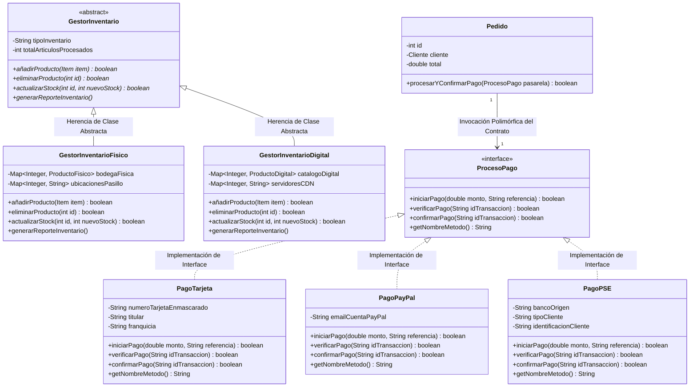

# ⚙️ CompraYa - Asignación No. 6: Interfaces y Clases Abstractas POO

**Asignación No. 6 - Implementación de Interfaces y Clases Abstractas en una Plataforma e-Commerce**  
**Curso:** CSE6041 – Object-Oriented Programming  
**Institución:** Broward International University (BIU)  
**Estudiante:** Alberto Alfonso López Pereira  
**Docente:** Dr. José Ignacio Requeno Jarabo  

---

## 📋 Descripción del Proyecto - Asignación 6

En la **Asignación No. 6**, se evoluciona la arquitectura de la plataforma e-Commerce **CompraYa** mediante el uso avanzado de **Clases Abstractas** e **Interfaces**, estableciendo contratos formales para dos de los procesos más críticos de una plataforma transaccional:
1. **Gestión Abstracta de Inventario (`GestorInventario`):** Definición de una superclase abstracta que estandariza las operaciones de alta, baja, actualización de existencias y generación de reportes de inventario, especializándose en:
   - **`GestorInventarioFisico`:** Controla existencias físicas en bodegas, pasillos y estantes.
   - **`GestorInventarioDigital`:** Controla licencias en la nube y servidores CDN de descarga.
2. **Procesamiento de Pagos basado en Contratos de Interfaz (`ProcesoPago`):** Definición de una interfaz que estandariza los métodos `iniciarPago()`, `verificarPago()`, `confirmarPago()` y `getNombreMetodo()`, implementada por tres pasarelas independientes:
   - **`PagoTarjeta`:** Procesamiento con tarjeta de crédito/débito encriptada (`**** **** **** 5566`), código CVC y autorización bancaria.
   - **`PagoPayPal`:** Procesamiento con billetera digital PayPal, autenticación OAuth2 y token PayerID.
   - **`PagoPSE`:** Procesamiento mediante débito en línea bancario PSE en Colombia.

---

## 🛠️ Tecnologías Utilizadas

- **Lenguaje de Programación:** Java 21 (OpenJDK / JetBrains Runtime).
- **Paradigma:** Programación Orientada a Objetos (Clases Abstractas, Interfaces, Polimorfismo, Encapsulamiento, Herencia).
- **Herramientas de Construcción:** `javac` (compilador nativo), `java` (máquina virtual).
- **Control de Versiones:** Git & GitHub.
- **Modelado:** UML 2.0 y Diagramas en sintaxis Mermaid.

---

## 📐 Diagrama de Clases UML - Asignación 6 (Mermaid)



---

## 💻 Detalles de Implementación Técnica

### 1. Gestión Abstracta de Inventario (`src/com/compraya/asignacion6/inventory/`)

- **Clase Abstracta `GestorInventario`:**
  Establece la firma obligatoria de los métodos de gestión de inventario:
  ```java
  public abstract boolean añadirProducto(Item item);
  public abstract boolean eliminarProducto(int id);
  public abstract boolean actualizarStock(int id, int nuevoStock);
  public abstract void generarReporteInventario();
  ```

- **`GestorInventarioFisico`:**
  Mantiene un `Map<Integer, ProductoFisico>` asignando pasillos y estantes de bodega física a cada ítem.

- **`GestorInventarioDigital`:**
  Mantiene un `Map<Integer, ProductoDigital>` vinculando nodos CDN globales y monitoreando cupos de licencias en la nube.

### 2. Procesamiento de Pagos basado en Interfaces (`src/com/compraya/asignacion6/payment/`)

- **Interfaz `ProcesoPago`:**
  ```java
  public interface ProcesoPago {
      boolean iniciarPago(double monto, String referencia);
      boolean verificarPago(String idTransaccion);
      boolean confirmarPago(String idTransaccion);
      String getNombreMetodo();
  }
  ```

- **Implementaciones Concretas:**
  - `PagoTarjeta`: Administra la enmascaración de tarjetas (`**** **** **** 5566`) y la autorización CVC.
  - `PagoPayPal`: Administra autenticación OAuth2 de cuentas de usuario PayPal.
  - `PagoPSE`: Administra débitos bancarios inmediatos de cuentas bancarias en Colombia.

- **Invocación Polimórfica en `Pedido`:**
  ```java
  public boolean procesarYConfirmarPago(ProcesoPago pasarela) {
      this.metodoPagoUsado = pasarela.getNombreMetodo();
      if (pasarela.iniciarPago(this.total, ref) && 
          pasarela.verificarPago(txnId) && 
          pasarela.confirmarPago(txnId)) {
          this.estado = "PAGADO";
          return true;
      }
      return false;
  }
  ```

---

## 📸 Captura y Log de Salida de Ejecución (Asignación 6)

Salida de la consola al ejecutar `com.compraya.asignacion6.MainAsignacion6`:

```text
====================================================================
          PLATAFORMA E-COMMERCE "COMPRAYA" - ASIGNACIÓN 6          
       Implementación de Interfaces y Clases Abstractas en Java     
====================================================================
Estudiante: Alberto Alfonso López Pereira
Docente:    Dr. José Ignacio Requeno Jarabo
Curso:      CSE6041 – Object-Oriented Programming (BIU)
====================================================================
[INVENTARIO FÍSICO] Producto 'Smartphone X Pro' registrado en Pasillo-2 (Estante 2) con stock: 15 unidades.
[INVENTARIO FÍSICO] Producto 'Cafetera Express' registrado en Pasillo-3 (Estante 3) con stock: 10 unidades.
[INVENTARIO DIGITAL] Licencia digital 'Curso Java OOP Avanzado' sincronizada en nodo CDN cdn-node-1.compraya.com (999 licencias).
[INVENTARIO DIGITAL] Licencia digital 'E-Book Arquitectura Software' sincronizada en nodo CDN cdn-node-2.compraya.com (999 licencias).

====================================================================
 1. GESTIÓN ABSTRACTA DE INVENTARIOS (GestorInventario)             
====================================================================
[INVENTARIO FÍSICO BODEGA]
[INVENTARIO FÍSICO] Stock físico actualizado para 'Smartphone X Pro': 20 unidades en bodega.
=======================================================
 📦 REPORTE BODEGA DE INVENTARIO FÍSICO (COMPRAYA)     
=======================================================
Tipo: INVENTARIO_FISICO_BODEGA | Artículos: 2
  • ID 1 | Smartphone X Pro       | Stock: 20   | Ubicación: Pasillo-2 (Estante 2) | Peso: 0,45 kg
  • ID 2 | Cafetera Express       | Stock: 10   | Ubicación: Pasillo-3 (Estante 3) | Peso: 4,20 kg
=======================================================

[INVENTARIO DIGITAL LICENCIAS NUBE]
[INVENTARIO DIGITAL] Cupo de licencias actualizado para 'Curso Java OOP Avanzado': 1500 disponibles en nube.
=======================================================
 💾 REPORTE INVENTARIO DIGITAL Y LICENCIAS (COMPRAYA)  
=======================================================
Tipo: INVENTARIO_DIGITAL_NUBE_CDN | Licencias Registradas: 2
  • ID 3 | Curso Java OOP Avanzado | Licencias: 1500 | Nodo CDN: cdn-node-1.compraya.com | Formato: MP4/ZIP (2450,0 MB)
  • ID 4 | E-Book Arquitectura Software | Licencias: 999  | Nodo CDN: cdn-node-2.compraya.com | Formato: PDF/EPUB (18,5 MB)
=======================================================

====================================================================
 2. PROCESOS DE PAGO POLIMÓRFICOS MEDIANTE LA INTERFAZ ProcesoPago  
====================================================================
[PRUEBA PASARELA 1: INTERFAZ ProcesoPago -> PagoTarjeta]
[PAGO TARJETA - VISA] Conectando con pasarela bancaria. Solicitud $150000,00 para ref 'REF-TEST-001' con tarjeta **** **** **** 5566 (Alberto López)...
[PAGO TARJETA - VISA] Verificando código CVC y autorización bancaria para TXN: TXN-CARD-991...
[PAGO TARJETA - VISA] ¡Fondos capturados exitosamente! TXN: TXN-CARD-991 por $150000,00

[PRUEBA PASARELA 2: INTERFAZ ProcesoPago -> PagoPayPal]
[PAGO PAYPAL] Redirigiendo a API REST PayPal OAuth2. Solicitante: 'alberto.lopez@paypal.com' | Monto: $85000,00 | Ref: 'REF-TEST-002'...
[PAGO PAYPAL] Validando token de autorización PayPal (PayerID) para TXN: TXN-PAYPAL-882...
[PAGO PAYPAL] ¡Pago verificado y transferido desde cuenta PayPal 'alberto.lopez@paypal.com'! TXN: TXN-PAYPAL-882 por $85000,00

[PRUEBA PASARELA 3: INTERFAZ ProcesoPago -> PagoPSE]
[PAGO PSE] Conectando con portal bancario Bancolombia (PERSONA_NATURAL - CC/NIT: 1018293847) por $220000,00 | Ref: 'REF-TEST-003'...
[PAGO PSE] Verificando débito inmediato en cuenta del banco Bancolombia para TXN: TXN-PSE-773...
[PAGO PSE] ¡Débito bancario en línea PSE confirmado desde Bancolombia! TXN: TXN-PSE-773 por $220000,00

====================================================================
 3. COMPRA EN CARRITO Y CHECKOUT CON PASARELA POLIMÓRFICA           
====================================================================
=== Carrito Asignación 6 (Total: $1620000,00) ===
 - Smartphone X Pro x1 -> Subtotal: $1500000,00
 - Curso Java OOP Avanzado x1 -> Subtotal: $120000,00

[EJECUTANDO CHECKOUT USANDO INTERFAZ ProcesoPago (PagoPSE)]
[PAGO PSE] Conectando con portal bancario Bancolombia (PERSONA_NATURAL - CC/NIT: 1018293847) por $1927800,00 | Ref: 'PED-1001'...
[PAGO PSE] Verificando débito inmediato en cuenta del banco Bancolombia para TXN: TXN-1789551856348...
[PAGO PSE] ¡Débito bancario en línea PSE confirmado desde Bancolombia! TXN: TXN-1789551856348 por $1927800,00
[PEDIDO #1001] ¡Pago completado mediante PSE Débito Bancario en Línea (Bancolombia)! Total: $1927800,00

==========================================
     DETALLE DE PEDIDO #1001 (ASIG. 6)      
==========================================
Cliente: Alberto López (alberto.lopez@example.com)
Estado: PAGADO | Método: PSE Débito Bancario en Línea (Bancolombia)
Dirección: Carrera 15 #93-60, Bogotá, Cundinamarca (110221) - Colombia
Ítems Adquiridos:
  • Smartphone X Pro (ID: 1) x1 @ $1500000,00 = $1500000,00
  • Curso Java OOP Avanzado (ID: 3) x1 @ $120000,00 = $120000,00
------------------------------------------
 Subtotal:  $1620000,00
 IVA (19%): $307800,00
 TOTAL:     $1927800,00
==========================================

====================================================================
  ¡DEMOSTRACIÓN DE LA ASIGNACIÓN NO. 6 COMPLETADA EXITOSAMENTE!    
====================================================================
```

---

## ⚡ Desafíos Enfrentados y Soluciones Aplicadas (Asignación 6)

| Desafío Enfrentado | Causa Raíz | Solución Aplicada |
| :--- | :--- | :--- |
| **Soporte de Múltiples Pasarelas de Pago sin Acoplamiento** | Cada pasarela de pago (Tarjeta, PayPal, PSE) requiere parámetros y protocolos distintos. Tener condicionales `if-else` en `Pedido` violaba el principio Abierto/Cerrado. | Se definió la interfaz `ProcesoPago` estandarizando el ciclo de vida de la transacción (`iniciarPago`, `verificarPago`, `confirmarPago`). `Pedido` delega el pago a la interfaz sin conocer la implementación concreta. |
| **Diferenciación de Operaciones de Inventario** | El inventario de bodega física requiere pasillos y estantes, mientras que el inventario digital requiere URLs CDN y cupos de licencias. | Se creó la clase abstracta `GestorInventario`, permitiendo que `GestorInventarioFisico` y `GestorInventarioDigital` implementen los detalles específicos de almacenamiento manteniendo la misma interfaz pública. |

---

## 🚀 Guía de Compilación y Ejecución (Asignación 6)

```powershell
cd eCommerceCSE6041
if (!(Test-Path bin)) { New-Item -ItemType Directory -Path bin }
javac -d bin (Get-ChildItem -Recurse -Filter *.java src).FullName
java -cp bin com.compraya.asignacion6.MainAsignacion6
```

---

## 📄 Archivos de Documentación Asignación 6

- [Documentación Técnica de Interfaces y Clases Abstractas](file:///c:/ProyectosBIU/eCommerceCSE6041/docs/DOCS_ARQUITECTURA_OOP_ASIGNACION_6.md)
- [Guía de Compilación y Publicación GitHub](file:///c:/ProyectosBIU/eCommerceCSE6041/docs/GUIA_EJECUCION_ASIGNACION_6.md)
- [Log de Consola de la Asignación 6](file:///c:/ProyectosBIU/eCommerceCSE6041/docs/EJECUCION_OUTPUT_ASIGNACION_6.txt)

---
© 2026 **Alberto Alfonso López Pereira** - Broward International University.
