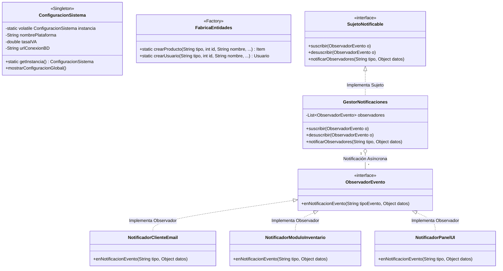

# 🧩 CompraYa - Asignación No. 7: Patrones de Diseño Singleton, Factory y Observer

**Asignación No. 7 - Implementación de Patrones de Diseño en una Plataforma e-Commerce**  
**Curso:** CSE6041 – Object-Oriented Programming  
**Institución:** Broward International University (BIU)  
**Estudiante:** Alberto Alfonso López Pereira  
**Docente:** Dr. José Ignacio Requeno Jarabo  

---

## 📋 Descripción del Proyecto - Asignación 7

En la **Asignación No. 7**, se incorporan tres de los patrones de diseño más importantes del *Gang of Four* (GoF) a la arquitectura de **CompraYa**, mejorando la mantenibilidad, el desacoplamiento y el manejo de eventos en la plataforma e-Commerce:

1. **Patrón Singleton (`ConfiguracionSistema`):**
   Garantiza que exista una única instancia global hilo-segura (*Thread-Safe Double-Checked Locking*) encargada de gestionar los parámetros del sistema (tasa de IVA 19%, moneda COP, cadena de conexión a base de datos PostgreSQL, estado de mantenimiento y límites de carrito).

2. **Patrón Factory (`FabricaEntidades`):**
   Centraliza e independiza la instanciación de objetos. Permite crear dinámicamente subclases de `Item` (`ProductoFisico`, `ProductoDigital`) y `Usuario` (`Cliente`, `Administrador`) mediante firmas parametrizadas de fábrica sin acoplar el código del cliente a constructores concretos.

3. **Patrón Observer (`GestorNotificaciones`):**
   Implementa un sistema de publicación y suscripción de eventos (*Publish-Subscribe*). Cuando ocurren cambios críticos (ej. confirmación de pago de un pedido, cambio de estado o alerta de stock bajo), el sujeto `GestorNotificaciones` transmite el evento en tiempo real a múltiples observadores independientes:
   - **`NotificadorClienteEmail`:** Envía correos electrónicos automáticos al comprador.
   - **`NotificadorModuloInventario`:** Activa reservas físicas en bodega u órdenes de reposición.
   - **`NotificadorPanelUI`:** Actualiza el dashboard de supervisión del administrador.

---

## 🛠️ Tecnologías Utilizadas

- **Lenguaje de Programación:** Java 21 (OpenJDK / JetBrains Runtime).
- **Patrones de Diseño GoF:** Singleton, Factory Method, Observer.
- **Herramientas de Construcción:** `javac` (compilador nativo), `java` (entorno de ejecución).
- **Control de Versiones:** Git & GitHub.
- **Modelado:** UML 2.0 y Diagramas en sintaxis Mermaid.

---

## 📐 Diagrama de Clases UML - Asignación 7 (Mermaid)



---

## 💻 Detalles de Implementación de los Patrones

### 1. Patrón Singleton (`src/com/compraya/asignacion7/config/ConfiguracionSistema.java`)
```java
public class ConfiguracionSistema {
    private static volatile ConfiguracionSistema instancia;

    private ConfiguracionSistema() {
        this.tasaIVA = 0.19;
        this.moneda = "COP";
    }

    public static ConfiguracionSistema getInstancia() {
        if (instancia == null) {
            synchronized (ConfiguracionSistema.class) {
                if (instancia == null) {
                    instancia = new ConfiguracionSistema();
                }
            }
        }
        return instancia;
    }
}
```

### 2. Patrón Factory (`src/com/compraya/asignacion7/factory/FabricaEntidades.java`)
```java
public static Item crearProducto(String tipo, int id, String nombre, double precio, ...) {
    if ("FISICO".equalsIgnoreCase(tipo)) {
        return new ProductoFisico(id, nombre, ..., peso, dimensiones, flete);
    } else if ("DIGITAL".equalsIgnoreCase(tipo)) {
        return new ProductoDigital(id, nombre, ..., formato, tamano, url, licencia);
    }
    throw new IllegalArgumentException("Tipo no soportado");
}
```

### 3. Patrón Observer (`src/com/compraya/asignacion7/observer/`)
```java
// Registro de suscriptores
gestorNotificaciones.suscribir(new NotificadorClienteEmail());
gestorNotificaciones.suscribir(new NotificadorModuloInventario());
gestorNotificaciones.suscribir(new NotificadorPanelUI());

// Transmisión del evento tras el pago del pedido
pedido.cambiarEstado("PAGADO", gestorNotificaciones);
```

---

## 📸 Captura y Log de Salida de Ejecución (Asignación 7)

Consola tras ejecutar `com.compraya.asignacion7.MainAsignacion7`:

```text
====================================================================
          PLATAFORMA E-COMMERCE "COMPRAYA" - ASIGNACIÓN 7          
        Implementación de Patrones Singleton, Factory y Observer    
====================================================================
Estudiante: Alberto Alfonso López Pereira
Docente:    Dr. José Ignacio Requeno Jarabo
Curso:      CSE6041 – Object-Oriented Programming (BIU)
====================================================================

====================================================================
 1. DEMOSTRACIÓN DEL PATRÓN SINGLETON (ConfiguracionSistema)        
====================================================================
=======================================================
 ⚙️ CONFIGURACIÓN GLOBAL DEL SISTEMA (SINGLETON)       
=======================================================
Plataforma:      CompraYa e-Commerce Platform
Versión:         7.0.2026 | Moneda: COP | IVA: 19.00%
Hash Instancia:  718231523
=======================================================

[VERIFICACIÓN SINGLETON]
   - Hash de la referencia config1: 718231523
   - Hash de la referencia config2: 718231523
   -> ¿(config1 == config2) es EXACTAMENTE la misma instancia?: SI (Singleton Garantizado)

====================================================================
 2. DEMOSTRACIÓN DEL PATRÓN FACTORY (FabricaEntidades)             
====================================================================
[FABRICA FACTORY] Instanciando ProductoFisico: 'Tablet Pro 11' ($1800000,00)
[FABRICA FACTORY] Instanciando ProductoDigital: 'Audiobook Clean Code' ($65000,00)

[PRODUCTOS CREADOS DESDE LA FÁBRICA]
ProductoFisico[ID: 10 | Tablet Pro 11 | $1800000,00 | Stock: 8 | Peso: 0,65 kg]
ProductoDigital[ID: 11 | Audiobook Clean Code | $65000,00 | Formato: MP3/M4B | Lic: LIC-AUDIO-2026]

====================================================================
 3. DEMOSTRACIÓN DEL PATRÓN OBSERVER (Notificaciones de Eventos)   
====================================================================
[PATRÓN OBSERVER] Nuevo observador suscrito: NotificadorClienteEmail
[PATRÓN OBSERVER] Nuevo observador suscrito: NotificadorModuloInventario
[PATRÓN OBSERVER] Nuevo observador suscrito: NotificadorPanelUI

[REALIZANDO CHECKOUT - SE ACTIVARÁ LA NOTIFICACIÓN DEL OBSERVER]
[PEDIDO #1001] Estado actualizado a: 'PAGADO'
[PATRÓN OBSERVER] Disparando evento 'CAMBIO_ESTADO_PEDIDO' a 3 observadores...
   📧 [OBSERVER - EMAIL CLIENTE] Enviando correo a 'Alberto López' (alberto.lopez@example.com): Su pedido #1001 ahora está en estado 'PAGADO'.
   📦 [OBSERVER - MÓDULO INVENTARIO] Pedido #1001 PAGADO -> Reservando físicamente 2 ítems en la bodega y generando orden de empaque.
   🖥️ [OBSERVER - PANEL ADMINISTRACIÓN UI] Evento recibido: 'CAMBIO_ESTADO_PEDIDO' -> Actualizando métricas del dashboard en vivo.

==========================================
     DETALLE DE PEDIDO #1001 (ASIG. 7)      
==========================================
Cliente: Alberto López (alberto.lopez@example.com)
Estado: PAGADO
Dirección: Carrera 7 #71-21, Bogotá, Cundinamarca (110231) - Colombia
Subtotal:  $1620000,00
IVA (19%): $307800,00
TOTAL:     $1927800,00
==========================================
```

---

## ⚡ Desafíos Enfrentados y Soluciones Aplicadas (Asignación 7)

| Desafío Enfrentado | Causa Raíz | Solución Aplicada |
| :--- | :--- | :--- |
| **Hilo-Seguridad en Singleton (*Race Conditions*)** | En entornos multihilo, dos hilos podían invocar `getInstancia()` en simultáneo y crear dos objetos distintos. | Se aplicó el patrón **Double-Checked Locking** con la variable marcada como `volatile`, garantizando sincronización sin penalizar el rendimiento tras la inicialización. |
| **Acoplamiento Directo en la Creación de Objetos** | El código cliente debía conocer los constructores y parámetros de `ProductoFisico` y `ProductoDigital`. | Se implementó el patrón **Factory Method** en `FabricaEntidades`, recibiendo parámetros dinámicos en un mapa para desacoplar la creación. |
| **Dependencia Circular en Notificaciones de Estado** | Notificar manualmente a cada servicio (inventario, email, dashboard) generaba código frágil y acoplado. | Se aplicó el patrón **Observer**, permitiendo registrar suscriptores que reaccionan asíncronamente al evento `CAMBIO_ESTADO_PEDIDO`. |

---

## 🚀 Guía de Compilación y Ejecución (Asignación 7)

```powershell
cd eCommerceCSE6041
if (!(Test-Path bin)) { New-Item -ItemType Directory -Path bin }
javac -d bin (Get-ChildItem -Recurse -Filter *.java src).FullName
java -cp bin com.compraya.asignacion7.MainAsignacion7
```

---

## 📄 Archivos de Documentación Asignación 7

- [Documentación Técnica de Patrones GoF](file:///c:/ProyectosBIU/eCommerceCSE6041/docs/DOCS_ARQUITECTURA_OOP_ASIGNACION_7.md)
- [Guía de Compilación y Publicación GitHub](file:///c:/ProyectosBIU/eCommerceCSE6041/docs/GUIA_EJECUCION_ASIGNACION_7.md)
- [Log de Consola de la Asignación 7](file:///c:/ProyectosBIU/eCommerceCSE6041/docs/EJECUCION_OUTPUT_ASIGNACION_7.txt)

---
© 2026 **Alberto Alfonso López Pereira** - Broward International University.
