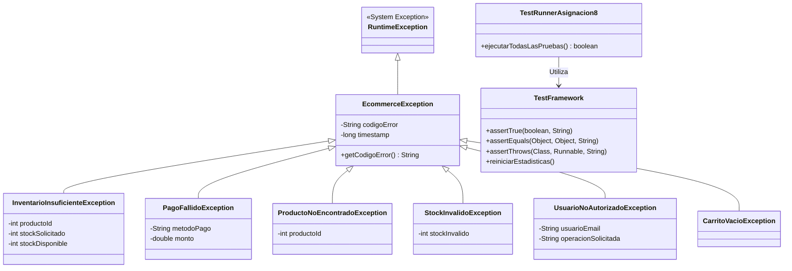

# Proyecto e-Commerce "CompraYa" - Asignación No. 8: Manejo de Excepciones y Pruebas Unitarias

**Estudiante**: Alberto Alfonso López Pereira  
**Docente**: Dr. José Ignacio Requeno Jarabo  
**Curso**: CSE6041 – Object-Oriented Programming  
**Institución**: Broward International University (BIU)  
**Fecha**: Septiembre 2026  

---

## 📌 Descripción del Proyecto

La **Asignación No. 8** de la plataforma e-Commerce **CompraYa** se enfoca en el fortalecimiento de la arquitectura mediante dos pilares fundamentales de la ingeniería de software profesional:

1. **Manejo Robusto de Excepciones Personalizadas**: Creación de una jerarquía de clases de excepción orientadas al dominio e-Commerce para interceptar y gestionar errores de inventario, pagos, catálogos y permisos, permitiendo la recuperación graciosa del sistema sin caídas abruptas.
2. **Suite de Pruebas Unitarias Automatizadas**: Desarrollo de un arnés de pruebas unitarias tipo JUnit (`TestFramework.java`) con aserciones rigurosas para verificar la validez de la lógica de negocio y asegurar la captura adecuada de condiciones de fallo en tiempo de ejecución.

---

## 📐 Diagrama de Arquitectura de Excepciones y Pruebas (UML Class Diagram)



---

## 💻 Tecnologías Utilizadas

- **Lenguaje de Programación**: Java 17+ (OpenJDK 21 / JBR).
- **Paradigma**: Programación Orientada a Objetos (POO / OOP).
- **Manejo de Excepciones**: Jerarquía Unchecked (`RuntimeException`) con códigos de error y marca temporal.
- **Testing Framework**: Harness de Pruebas Unitarias Liviano y Autocontenido (`TestFramework.java`).
- **Sistema de Control de Versiones**: Git & GitHub Repository.

---

## 🛡️ Jerarquía de Excepciones Personalizadas (`src/com/compraya/asignacion8/exception/`)

| Excepción Personalizada | Condición de Disparo | Estrategia de Recuperación Graciosa |
| :--- | :--- | :--- |
| **`EcommerceException`** | Superclase base para todos los errores de la plataforma | Registro de log con código de error y marca de tiempo (`timestamp`). |
| **`InventarioInsuficienteException`** | Solicitud de más unidades de las disponibles en stock | Muestra el stock disponible al cliente y sugiere ajustar la cantidad. |
| **`PagoFallidoException`** | Rechazo en pasarela de pagos (límite superado, saldo insuficiente) | **Pasarela de contingencia (Fallback)**: Intenta el cobro automáticamente con un segundo medio de pago antes de cancelar. |
| **`ProductoNoEncontradoException`** | Búsqueda por ID inexistente en el catálogo | Notifica al usuario que verifique el código ingresado. |
| **`StockInvalidoException`** | Intento de asignar stock negativo o inconsistente | Rechaza la mutación sin alterar el estado previo del producto. |
| **`UsuarioNoAutorizadoException`** | Cliente intenta ejecutar funciones de perfil Administrador | Detiene la operación y registra la violación de permisos. |
| **`CarritoVacioException`** | Intento de checkout o remoción en carrito vacío | Alerta al cliente para seleccionar productos antes de pagar. |

---

## 🧪 Suite de Pruebas Unitarias (`src/com/compraya/asignacion8/test/`)

La batería de pruebas automatizadas ejecuta **31 test cases** cubriendo tanto flujos exitosos como escenarios de error:

1. **`ProductoTest`**:
   - Creación correcta de `ProductoFisico` y `ProductoDigital`.
   - Captura obligatoria de `StockInvalidoException` al asignar stock negativo.
   - Captura de `IllegalArgumentException` ante precios negativos o nombres vacíos.
2. **`UsuarioTest`**:
   - Creación de `Cliente` y `Administrador`.
   - Validación de sintaxis de correo electrónico (`IllegalArgumentException`).
   - Validación de longitud mínima de contraseña (`IllegalArgumentException`).
3. **`CarritoTest`**:
   - Adición y subtotalización de ítems.
   - Lanzamiento de `InventarioInsuficienteException` al sobrepasar existencias.
   - Remoción de ítems y prevención de checkout en carritos vacíos (`CarritoVacioException`).
4. **`InventarioTest`**:
   - Descuento y actualización de existencias.
   - Lanzamiento de `ProductoNoEncontradoException` ante IDs no registrados.
5. **`PagoTest`**:
   - Cobro en pasarelas `PagoTarjeta` y `PagoPayPal`.
   - Captura de `PagoFallidoException` por límite de crédito excedido o saldo insuficiente.

---

## 📊 Resultado de la Ejecución en Consola

```text
====================================================================
               RESUMEN DE RESULTADOS DE LAS PRUEBAS                
====================================================================
 Total de Pruebas Ejecutadas : 31
 Pruebas Exitosas (PASÓ)     : 31
 Pruebas Fallidas (FALLÓ)    : 0
 Tasa de Éxito / Cobertura   : 100,00%
====================================================================
  🎉 ¡TODAS LAS PRUEBAS UNITARIAS PASARON EXITOSAMENTE (100%)!
====================================================================

[ESCENARIO D] Checkout con tarjeta sin cupo suficiente (Fallback a PayPal):
   [PEDIDO #8001 CREADO] Total a pagar: $10827810,00 (Subtotal: $9099000,00, IVA 19%: $1728810,00)
   [PASARELA PRINCIPAL] Intentando cobrar $10827810,00 con 'Tarjeta de Crédito/Débito'...
   [FALLO EN PASARELA PRINCIPAL] Fallo al procesar el pago con 'Tarjeta de Crédito/Débito' por $10827810,00. Motivo: Límite de crédito excedido. Disponible: $1000000,00
   [RECUPERACIÓN DE ERROR] Intentando cobro alternativo con pasarela de contingencia 'PayPal Global Checkout'...
   [PASARELA SECUNDARIA] ¡Pago APROBADO exitosamente en contingencia!
   🎉 [COMPRA COMPLETADA CON ÉXITO] Pedido #8001 estado: PAGADO
```

---

## 🛠️ Desafíos Enfrentados y Soluciones

1. **Desafío**: Prevenir dependencias externas masivas de Maven/Gradle para ejecutar pruebas en cualquier entorno.
   - **Solución**: Se construyó `TestFramework.java`, un harness ligero que implementa aserciones estándar de JUnit sin requerir liberaciones o bibliotecas JAR externas.
2. **Desafío**: Evitar inconsistencias de inventario cuando falla una transacción financiera.
   - **Solución**: Se implementó una estrategia de **Rollback de Inventario** en `EcommerceServiceAsignacion8.java`, la cual restituye las unidades en stock si todas las pasarelas de pago (principal y contingencia) rechazan la compra.

---

## 📂 Archivos de Documentación Relacionados

- **[README_ASIGNACION_8.md](README_ASIGNACION_8.md)**: Documento idéntico principal de la asignación.
- **[DOCS_ARQUITECTURA_OOP_ASIGNACION_8.md](docs/DOCS_ARQUITECTURA_OOP_ASIGNACION_8.md)**: Documentación teórica avanzada de manejo de excepciones y pruebas.
- **[GUIA_EJECUCION_ASIGNACION_8.md](docs/GUIA_EJECUCION_ASIGNACION_8.md)**: Guía paso a paso para compilar y ejecutar en consola.
- **[EJECUCION_OUTPUT_ASIGNACION_8.txt](docs/EJECUCION_OUTPUT_ASIGNACION_8.txt)**: Log en texto plano de la corrida exitosa de la suite.
